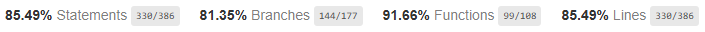
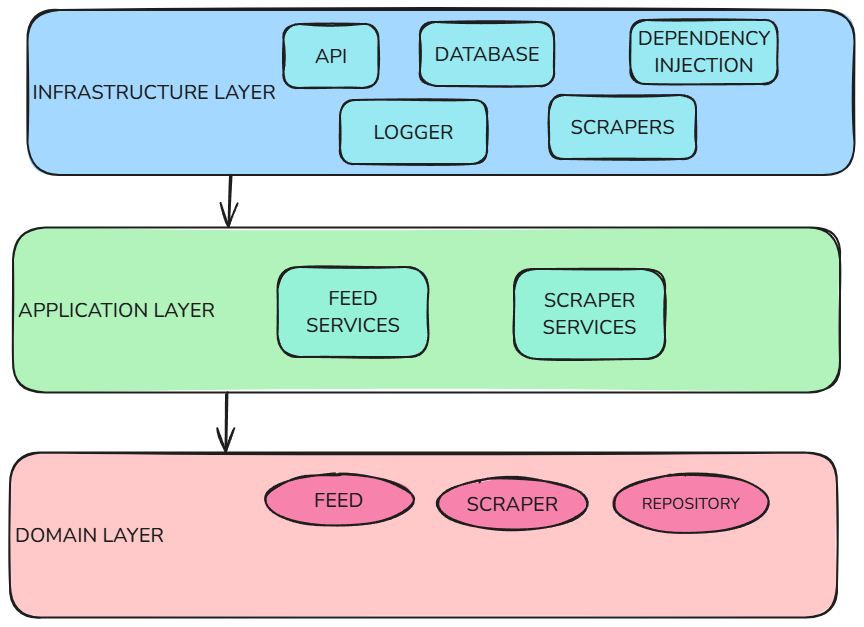
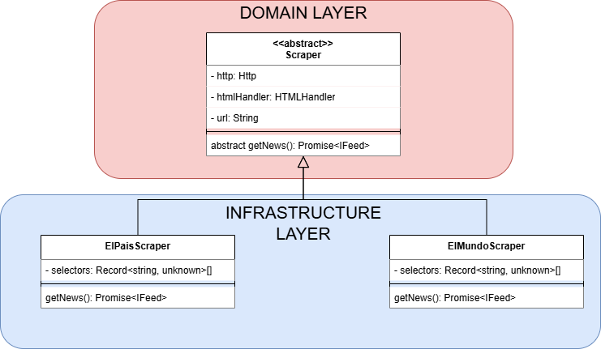
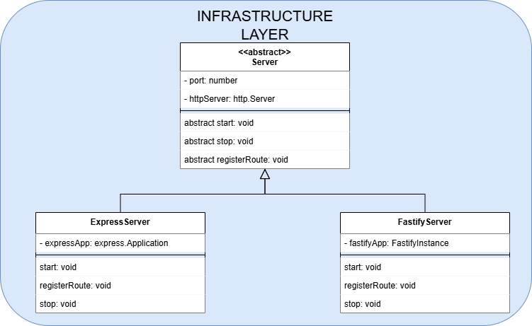
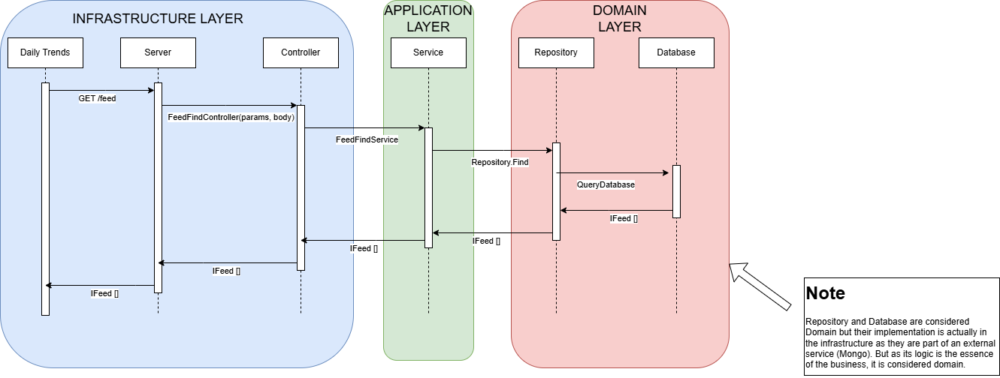

# Daily-Trends

## Table of contents

* [Installation](#Installation)
* [Instructions](#Instructions)
* [Tests](#Tests)
* [Architecture](#Architecture)

## Installation

To work, it is necessary to have an instance of mongodb running on port 27017 (This can be changed using the `MONGO_URL` environment variable).

In order to build a mongo instance, the repository includes a `docker-compose` with a basic configuration.

Run the following command:

Windows:
```sh
docker compose up
```

Linux:
```sh
docker-compose up
```

## Instructions

First the dependencies must be installed using `npm install`.

### Development

The server can be started in development mode with the following command

```sh
npm run dev
```

By default, the server will start in [express](https://www.npmjs.com/package/express), mode, this behaviour can be changed by using command arguments

```sh
npm run dev -- express
npm run dev -- fastify
```

The options available are [express](https://www.npmjs.com/package/express) and [fastify](https://www.npmjs.com/package/fastify)

### Production

To run the server in production mode, the first step is to compile the code

```sh
npm run build
```

And then run the server

```sh
npm run start
```

By default, the server will start in [express](https://www.npmjs.com/package/express), mode, this behaviour can be changed by using command arguments

```sh
npm run dev -- express
npm run dev -- fastify
```

The options available are [express](https://www.npmjs.com/package/express) and [fastify](https://www.npmjs.com/package/fastify)

## Tests

The following commands are used to run the tests

```sh
npm run test
```

And to run them and obtain coverage

```sh
npm run test:coverage
```

Current unit test coverage is:



## Architecture

The architecture of daily-trends follows the DDD (Domain-Drive-Design) architecture in which it is divided into three main groups

* Domain
* Application
* Infrastructure

The innermost layers cannot depend on the outermost layers, this means that Domain cannot have external domain dependencies, application can only have domain dependencies and infrastructure can depend on anyone.



To give some examples, the scraping system is organised in the following way



And the available servers (express and fastify) as follows



Finally, a sequence diagram of an API request

